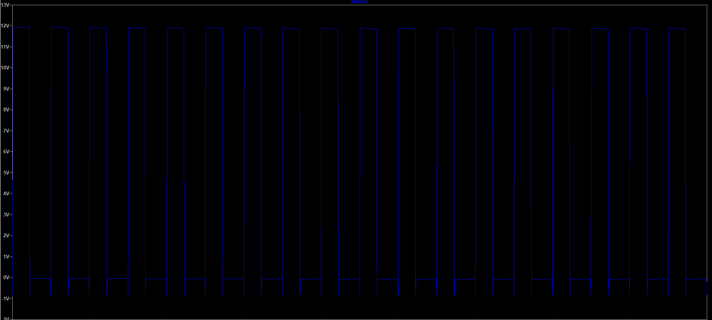
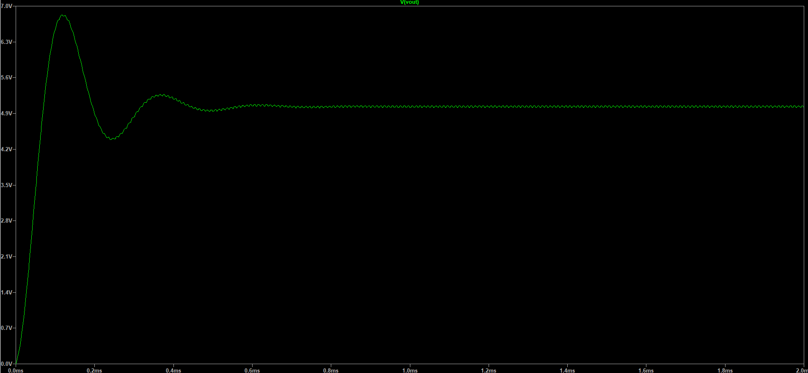
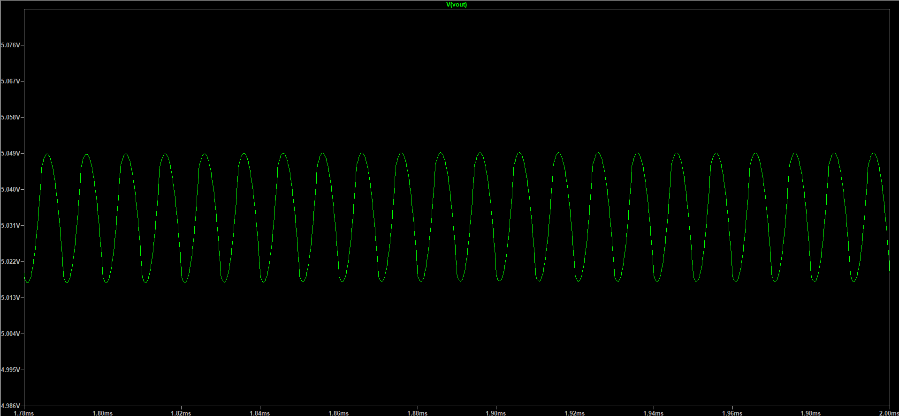
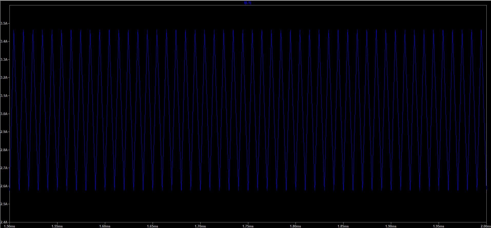
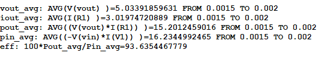

# Synchronous Buck Converter LTspice Simulation

A **12 V → 5 V @ 3 A** synchronous buck converter simulated in LTspice. This is the realistic-power-stage refinement of the Phase 1 open-loop work: the ideal high-side switch + Schottky freewheel diode is replaced by a **two-MOSFET synchronous stage** (high-side + low-side N-channel), driven by independent gate signals with **dead time** to prevent shoot-through, and with **inductor DCR** and **capacitor ESR** added so the loss budget — and therefore the efficiency number — is meaningful.

> Part of the larger [`digital-buck-converter`](../../README.md) project. See the root README for the full Phase 0–7 roadmap and the [`docs/devlog/`](../../docs/devlog/) for the running build log.

## Design goals

- Convert **12 V** input to a regulated **5 V** output at **3 A** (15 W) in continuous conduction.
- Use a **true synchronous topology** (low-side MOSFET instead of a diode) to cut freewheel-conduction loss.
- Insert **gate-drive dead time** so the high-side and low-side devices are never on simultaneously (no shoot-through).
- Model **parasitic loss** — inductor series resistance (DCR) and capacitor ESR — to get a realistic, not idealized, efficiency.
- Verify average V_out, I_out, and efficiency with LTspice `.meas` statements over the steady-state window.

## Circuit topology

Synchronous (two-switch) buck:

```
        M1 (high-side NMOS)        L1 (33 µH, DCR 0.05 Ω)
  Vin ───►──┐                ┌──────[ ⎍⎍⎍ ]──────┬───── Vout
   12 V     │      SW node   │                    │
            ├────────────────┤                    │
            │                │                  C1 ┴ 44 µF
        sw (low-side NMOS) ──┤                  ESR 0.03 Ω
            │                │                    │      R1
           GND              GND                  GND   1.667 Ω
```

- **M1 — high-side NMOS** (`NMOS_HS`): connects the inductor to V_in during the on-time. Driven by a gate pulse referenced high enough (17 V) to keep V_GS above threshold while the source rides up to V_in.
- **sw — low-side NMOS** (`NMOS_LS`): replaces the freewheel diode, providing the inductor current path during the off-time with a low R_DS(on) drop instead of a diode V_F. This is what makes the converter *synchronous*.
- **L1 / C1 / R1**: the output LC filter and load. `Rser` on L1 and C1 model DCR and ESR respectively.

The two MOSFET models (`.model` cards in the schematic) carry finite on-resistance (`RS`/`RD`) and gate capacitance (`CGSO`/`CGDO`), so switching and conduction losses both show up in the input-power measurement.

## Component values

| Component | Value | Notes |
|---|---|---|
| V_in (V1) | 12 V | DC input |
| L1 | 33 µH | Rser = 0.05 Ω (DCR) |
| C1 | 44 µF | Rser = 0.03 Ω (ESR) |
| R1 (load) | 1.667 Ω | sets 5 V / 3 A ≈ 15 W |
| Switching frequency | 100 kHz | 10 µs period |
| High-side device | NMOS_HS | VTO = 2, KP = 50, RS = RD = 0.015 Ω |
| Low-side device | NMOS_LS | VTO = 2, KP = 80, RS = RD = 0.010 Ω |

## Simulation setup

Transient analysis to steady state, with measurements taken over the last 0.5 ms once the output has settled:

```spice
.tran 0 2m 0 100n
.meas tran Vout_avg AVG V(vout)            FROM 1.5m TO 2m
.meas tran Iout_avg AVG I(R1)              FROM 1.5m TO 2m
.meas tran Pout_avg AVG (V(vout)*I(R1))    FROM 1.5m TO 2m
.meas tran Pin_avg  AVG (-V(vin)*I(V1))    FROM 1.5m TO 2m
.meas tran Eff      PARAM 100*Pout_avg/Pin_avg
```

P_in is measured as `−V(vin)·I(V1)` (power *delivered* by the source), P_out as `V(vout)·I(R1)`, and efficiency is their ratio — all averaged over the same 1.5–2 ms window so the result reflects steady-state operation, not the startup transient.


## Gate drive & dead time

The two MOSFETs are driven by independent `PULSE` sources, deliberately staggered so they never conduct at the same instant:

| Switch | Source | Turn-on | On-time | Period |
|---|---|---|---|---|
| High-side (M1) | V2 = `PULSE(0 17 0 100n 100n 4.3u 10u)` | t = 0 | 4.3 µs | 10 µs |
| Low-side (sw) | V3 = `PULSE(0 5 4.5u 100n 100n 5.3u 10u)` | t = 4.5 µs | 5.3 µs | 10 µs |

The high-side turns **off** at ~4.3 µs but the low-side does not turn **on** until 4.5 µs — a **~200 ns dead time** where both devices are off and the inductor current freewheels through the low-side body diode. A matching dead band exists at the end of the cycle before the high-side turns back on at 10 µs. This guarantees the two FETs are never simultaneously conducting, which would otherwise short V_in to ground (shoot-through) and destroy real hardware.

The effective duty is **D ≈ 4.3 µs / 10 µs = 43 %** — slightly above the ideal `D = 5/12 = 41.7 %`, the extra duty covering the MOSFET R_DS(on), DCR, and ESR drops.


## Key waveforms to review

**Switch node** — the SW node swings rail-to-rail (≈ 0 → 12 V) at 100 kHz as the two FETs hand off; the dead-time notches are visible at the edges:



**Output voltage** — startup transient ringing down to a regulated DC near 5 V, and a zoomed view of the steady-state ripple:




**Inductor current** — the steady-state triangular ripple around the 3 A DC operating point:



## Final measured results

Measured by the LTspice `.meas` statements over the 1.5–2 ms steady-state window:

| Metric                 |   Result |
| ---------------------- | -------: |
| Input Voltage          |     12 V |
| Average Output Voltage | 5.0339 V |
| Average Output Current | 3.0197 A |
| Output Power           | 15.201 W |
| Input Power            | 16.234 W |
| Simulated Efficiency   |   93.64% |



## Efficiency calculation

$$\eta = \frac{P_{out}}{P_{in}} \times 100\%$$

$$\eta = \frac{15.201\ \text{W}}{16.234\ \text{W}} \times 100\% = 93.64\%$$

The ~1.03 W of loss is spread across MOSFET conduction (R_DS(on)) and switching, inductor DCR, and capacitor ESR — exactly the parasitics added in this realistic stage. A synchronous topology lands well above what the asynchronous Phase 1 diode version could reach, since the diode's ~0.4 V forward drop at 3 A alone would dissipate over a watt.

## How to run

1. Open `buckConverterRealness.asc` in **LTspice**.
2. Run the transient simulation (**Run**, or `Ctrl+R`).
3. Probe and plot:
   - `V(vout)` — output voltage (startup + ripple)
   - `V(sw)` — switch-node waveform
   - the gate-drive nodes (high-side / low-side PWM) to see the dead time
   - `I(L1)` — inductor current ripple
4. Open the **SPICE error log** (`Ctrl+L`, or View → SPICE Error Log) to read the `.meas` results: `Vout_avg`, `Iout_avg`, `Pout_avg`, `Pin_avg`, and `Eff`.

## Notes & caveats

These are **simulation** results, not bench measurements. The numbers depend on:

- The **MOSFET models** used (idealized `.model` NMOS cards with chosen VTO/KP/RS/RD/capacitances, not vendor SPICE models of specific parts).
- The assumed **DCR (0.05 Ω)** and **ESR (0.03 Ω)** — real components vary with part choice, temperature, and frequency.
- The **gate-drive assumptions** — ideal voltage-source PWM with fixed 200 ns dead time and 100 ns edges; a real gate driver adds propagation delay, finite drive strength, and bootstrap dynamics.
- No PCB parasitics (trace inductance/resistance), thermal effects, or gate-drive power are modeled.

Real hardware efficiency will differ; the value here is a design-stage sanity check that the synchronous stage and loss budget behave as expected before committing to a PCB.

## Conclusion

The synchronous buck stage hits its targets in simulation: **5.03 V / 3.02 A** output with **93.6 % efficiency**, gate-drive dead time cleanly preventing shoot-through, and the parasitic loss model giving a believable (not idealized-100 %) efficiency figure. Replacing the freewheel diode with a low-side MOSFET is the dominant efficiency win, and the design is now ready to carry forward into the synchronous power-stage BOM and PCB phases.
