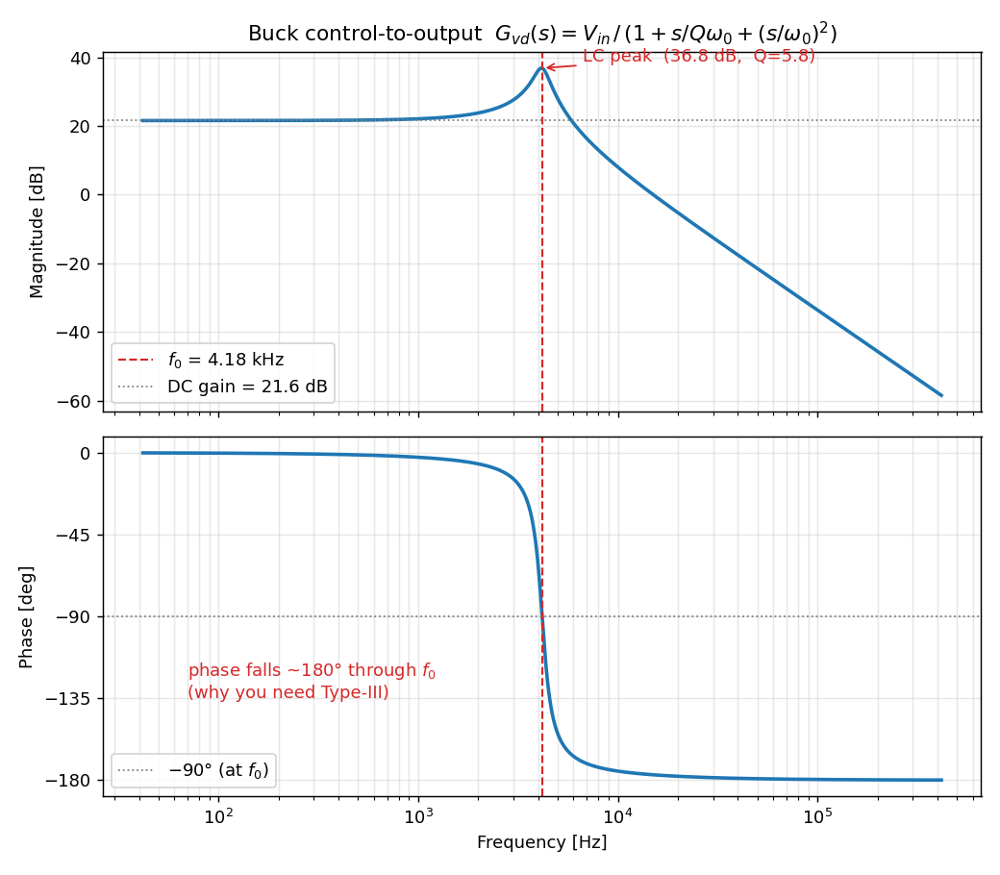
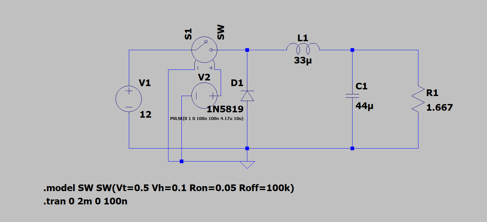
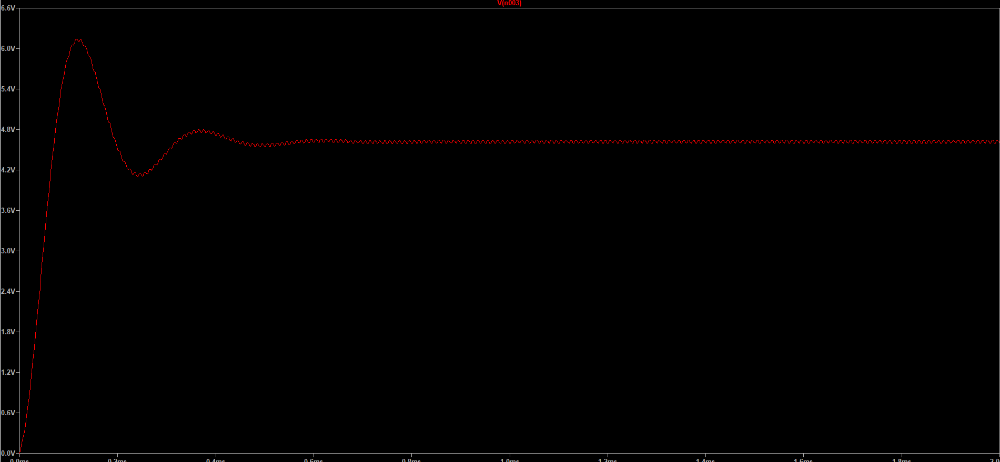
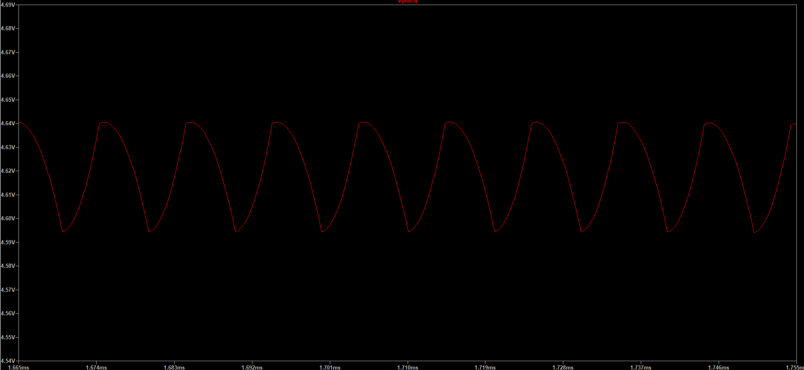
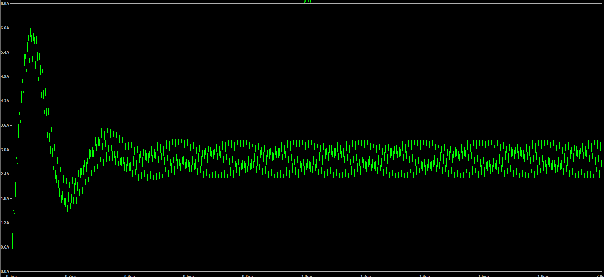
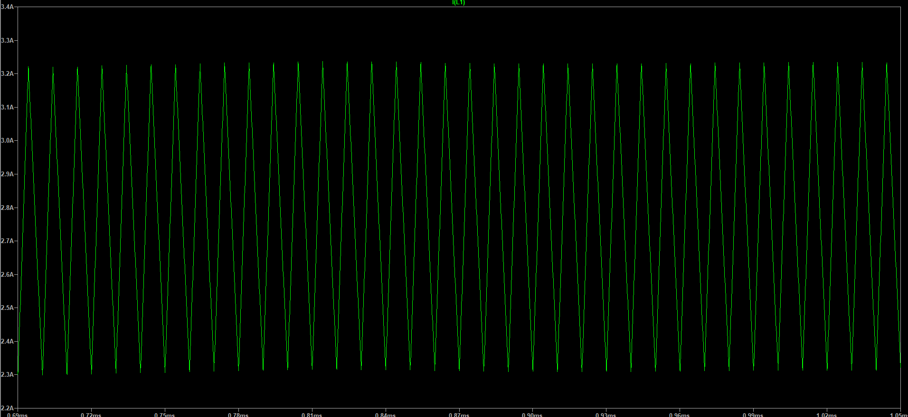
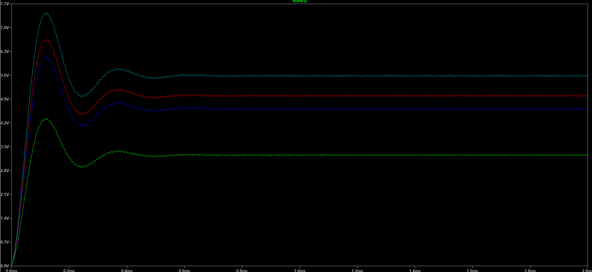
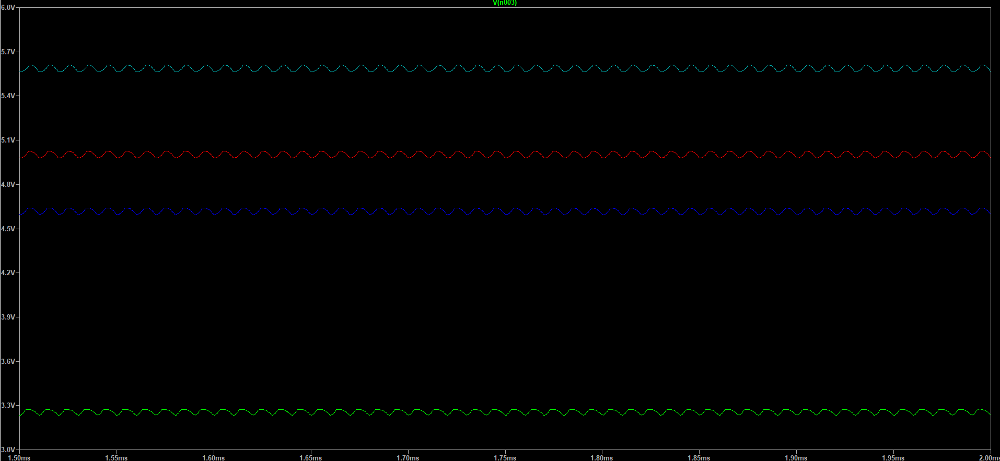
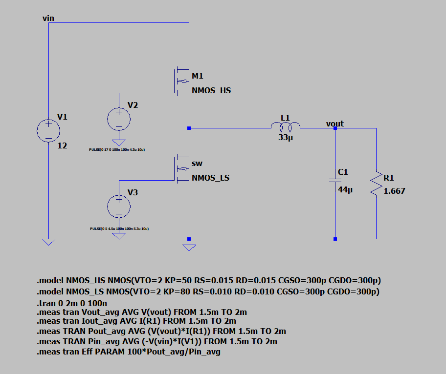
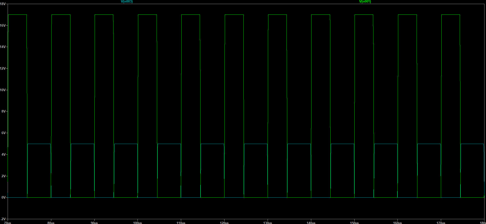

# Digitally Controlled Synchronous Buck Converter

A from-scratch **12 V → 5 V @ 3 A** synchronous buck converter, regulated by a closed control loop I design myself and run on an **STM32G4** microcontroller. The goal is to take one power converter all the way from first-principles theory → simulation → custom PCB → bring-up → digital compensator → measured closed-loop validation, and document every step.

> **Status:** Phase 1 complete (open-loop LTspice sim — power stage verified against the hand calcs). Actively building — see [`docs/devlog/`](docs/devlog/) for the running log.

## Target specification

| Parameter | Value |
|---|---|
| Topology | Synchronous buck (2× N-channel MOSFET) |
| Input | 12 V DC (bench supply, current-limited) |
| Output | 5 V @ 3 A (15 W) |
| Switching frequency | 100 kHz (→ 300–500 kHz later) |
| Control | Digital voltage-mode (STM32G4, design-by-emulation) |
| Output ripple target | < 50 mV |
| Inductor ripple | ~30 % of I_out (≈ 0.9 A) |

*Low-voltage by design — 12 V means no mains, no shock hazard. Brought up behind a current limit every time.*

## Phase 0 — Theory & small-signal model ✅

Derived the buck from first principles (volt-second balance, CCM duty `D = V_out/V_in`, ripple equations — see [`Phase0/HandNotesAndDerivations.pdf`](Phase0/HandNotesAndDerivations.pdf)) and built the **control-to-output transfer function** `G_vd(s)` — the plant the digital compensator will later stabilize.

For a voltage-mode buck the output L–C filter forms a resonant **double-pole**:

```
G_vd(s) = V_in / ( 1 + s/(Q·ω₀) + (s/ω₀)² )

ω₀ = 1/√(LC)        Q = R_load·√(C/L) = R_load / Z₀
L = 33 µH,  C = 44 µF,  V_in = 12 V,  R_load = 5 Ω  →  f₀ ≈ 4.2 kHz
```



**Key takeaway:** the phase plunges ~180° as the sweep passes `f₀`. A double-pole burns phase margin fast — which is exactly why a plain integrator can't stabilize this loop and a **Type-III compensator** is needed in Phase 5 to claw the phase back. Identifying this now is the whole point of modeling the plant before touching hardware.

Reproduce:

```bash
python -m venv ee-venv
ee-venv/Scripts/activate        # Windows  (source ee-venv/bin/activate on Linux/Mac)
pip install -r requirements.txt
python Phase0/gvd_bode.py
```

## Phase 1 — Open-loop LTspice simulation ✅

Built the open-loop power stage in **LTspice** ([`Phase1/idealBuckConverter/buckConverter.asc`](Phase1/idealBuckConverter/)) — ideal high-side switch + **1N5819 Schottky** freewheel diode (asynchronous for now; the synchronous low-side FET arrives with the Phase 2 power stage). Same values as Phase 0 (`12 V`, `L = 33 µH`, `C = 44 µF`, `R_load = 1.667 Ω` for 5 V / 3 A) switching at **100 kHz**, with the duty **swept** via `.step` to map V_out vs. D.



**What the sim confirmed:**

| Quantity | Target | Simulated | |
|---|---|---|---|
| Output ripple | < 50 mV | **≈ 45 mV** pk-pk | ✅ |
| Inductor ripple | ~0.9 A (30 %) | **≈ 0.95 A** (2.30→3.25 A) | ✅ |
| Startup ring | `f₀ ≈ 4.2 kHz` | rings at ~`f₀`, ~30 % overshoot, settles ~0.8 ms | ✅ matches `G_vd(s)` |

**Output voltage** — startup overshoots to ~6.1 V, rings down, settles to a regulated DC by ~0.8 ms; zoomed steady state shows the ~45 mV ripple:




**Inductor current `I(L1)`** — a current-mode inrush peak of ~6.1 A at startup decays into the steady-state triangular ripple band (~2.30 → 3.25 A, ΔI ≈ 0.95 A) by ~0.4 ms:




**The interesting finding — open-loop DC error.** At the *ideal* duty `D = V_out/V_in = 0.417`, V_out settles to only **~4.62 V**, not 5.0 V. The Schottky drop (~0.4 V) plus switch/L/C series resistance mean real hardware needs a **higher** duty. The sweep quantifies it — a true 5 V open-loop wants **D ≈ 0.45**:

| Ton | D | V_out |
|---|---|---|
| 3.0 µs | 0.30 | ≈ 3.25 V |
| 4.17 µs | 0.417 | ≈ 4.62 V |
| 4.5 µs | 0.45 | ≈ 4.97 V |
| 5.0 µs | 0.50 | ≈ 5.58 V |

The full `.step` sweep (each trace a different on-time) — and the same traces zoomed to steady state — show V_out tracking duty monotonically, with the LC overshoot growing as D rises:




**Key takeaway:** ripple targets are met, and the underdamped startup ring is the **same `f₀` double-pole** the Phase 0 model predicted — theory and sim agree in the time domain. The DC offset between ideal and required duty is precisely the error the digital loop will null out in Phase 5. Full write-up: [`docs/devlog/2026-06-04-phase1-open-loop-sim.md`](docs/devlog/2026-06-04-phase1-open-loop-sim.md).

### Synchronous upgrade — realistic power stage

Refined the Phase 1 stage from the ideal switch + Schottky diode into a **true synchronous buck** — high-side **and** low-side N-channel MOSFETs with gate-drive **dead time** (no shoot-through), plus **inductor DCR** and **capacitor ESR** for a believable loss budget ([`Phase1/BuckConverterWithRealness/`](Phase1/BuckConverterWithRealness/)).



The two MOSFETs are driven by independent PWM sources staggered with a **~200 ns dead band** so they never conduct simultaneously:



At `D ≈ 43 %` the `.meas` window reports **5.03 V / 3.02 A** out at **93.6 % efficiency**:

| Metric | Result |
|---|---:|
| Average output voltage | 5.0339 V |
| Average output current | 3.0197 A |
| Output power | 15.201 W |
| Input power | 16.234 W |
| Simulated efficiency | 93.64 % |

Replacing the freewheel diode with a low-side FET is the dominant efficiency win. Full breakdown — schematic, gate-drive/dead-time timing, switch-node and ripple waveforms, and caveats — in [`Phase1/BuckConverterWithRealness/README.md`](Phase1/BuckConverterWithRealness/README.md).

## Build roadmap

| Phase | What | Status |
|---|---|---|
| 0 | Theory & small-signal model (G_vd Bode) | ✅ Done |
| 1 | Open-loop LTspice simulation (verify D, ripple, transient) | ✅ Done |
| 2 | Power-stage design & BOM (synchronous, real parts) | ⏳ Next |
| 3 | PCB layout in KiCad → JLCPCB | ☐ |
| 4 | Bring-up & open-loop bench test | ☐ |
| 5 | Digital control firmware (compensator → difference equation in the ISR) | ☐ |
| 6 | Closed-loop tuning & validation (loop-gain Bode/SFRA, transient, efficiency) | ☐ |
| 7 | Document & publish | (ongoing) |

## Repository layout

```
Phase0/           hand derivations (PDF) + G_vd(s) model & Bode plot
Phase1/           open-loop LTspice power stage (.asc) + simulation plots
docs/devlog/      dated entry per work session — the running build log
requirements.txt  Python modeling toolchain (numpy, scipy, matplotlib, control)
```
Later phases add a KiCad project (hardware), an STM32CubeIDE project (firmware), and measured-data plots. The local Python venv (`ee-venv/`) is git-ignored — recreate it from `requirements.txt`.

## Tooling

Python (numpy / scipy / matplotlib / python-control) · LTspice · KiCad · STM32G4 (Nucleo-G474RE) · STM32CubeIDE

---
*Build log and design notes in [`docs/devlog/`](docs/devlog/). This repo documents the process, not just the result.*
